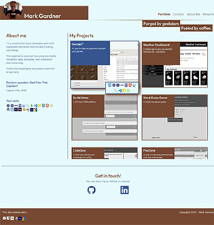
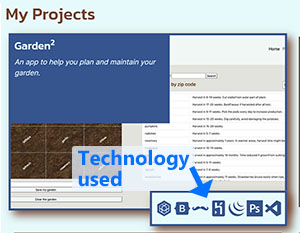
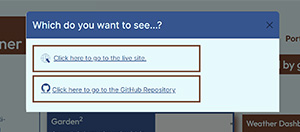
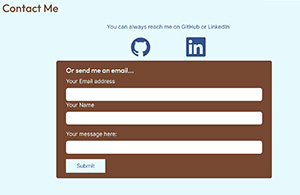
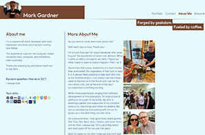
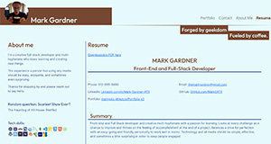

# Personal React Portfolio 

## An update of my portfolio page using React, Bootstrap, Greensock, and more.

___

This project is meant to push our understanding and famililarity with React by having us redesign our portfolio pages to take advantage of React functionality.

I considered starting from scratch to really get a feel for the framework, but I liked the foundation of my version 2 Portfolio and decided I wanted to expand on that. That meant I had to reimagine my entire page as components nested all around each other. Considering the nunmber of nested `div` and DOM elements I already had, this was going to be a challenge with the limited time to turn things in.

Let's see how it all turned out.

[You can see it live here to take a look. ](https://markgatx.github.io/Portfolio-v2)

___

## How to use

When you first get to the page you'll be greeted wity flying coffee cups and the body of the page animating in. 

Once the page is fully drawn, you'll see two sections: "About Me" and "My Projects."

The "About Me" section gives a quick glimpse into who I am and the philosophy I take when I create things. There's also a random fact about me that will change with every page load. Underneath that, you'll see a listing of technologies that I've used in projects in the past.

"My Projects," appropriately enough, showcases my projects. It's a combination of personal projects I've done by myself and other development projects I've worked on with other people. There are even some of the projects I've completed in the digital media space. 

When you hover over a project, the project will switch to full color and a box will open at the bottom right. That shows different technologies that were used to create that project. If you're not sure what an icon represents, you can hover over it with your mouse and the name will pop up as a tool-tip.

Once you click on the project, a modal dialog with open asking if you want to visit the live site or check under the hood with the GitHub code. Take your pick and be spirited away. NOTE: for projects I've included that don't have any connection to GitHub, clicking on the project will take you directly to the YouTube page where those projects are housed.

In the navigation bar at the top you have other options to look at. 

- **Contact Me**: This opens up a contact page with links to my GitHub, LinkedIn, and a Contact Form. Fill out the form with valid information and a message will be sent. NOTE: The message currently doesn't send, even though there is a confirmation dialog. If you need or want to get in touch with me in real life, please use GitHub or LinkedIn.

- **About Me**: The brief for this assignment calls for a separate About Me page, so I added more about me. When you click here you'll find some more thoughts from me as well as a small image gallery to give you an idea of who I am and what I like to do.

- **Resume**: Click here and you'll be taken to an online version of my resume for you to look over. If you'd like your own copy, there's a link at the top of the page for a PDF version of my resume you can then download.
    

___

## Changes Made and Lessons Learned

- Version 2 of my portfolio was already a fairly large construction. Reformatting it for React was daunting. That was almost enought to make me start from scratch. But at the end of the day I decided to simply break it down into smaller pieces until it made sense. Once I broke down the page into separate components, it became clear where I needed to go. Deconstructing Version 2 became easy at that point. The challenge was still making it work in React.

- Formatting everything to take advantage of React was a lesson in patience. Apart from the pain of replacing every `class` declaration with `className`, there were a lot of tiny details that tripped me up. At the end of the day I got the page back working as intended and even added some more bells and whistles. However, some things are still not working as intended.

- The Contact Form is currently an exercise in validation and form submission. With no server running the site, I really don't have a way to actually send messages with the form.

- Greensock is broken. Well, my implementation of Greensock is broken. Working with Greensock in vanilla JavaScript is fairly simple and fun. For some reason getting the same functionality in React has proven to be a challenge. I at least got the pages rendering with GSAP code included. But nothing is animating yet. It has to do with `useRef()` in React and also some strange warnings about some modules not being registered with GSAP. I'll keep hammering at it and keep looking for more documentation to show me what I've done wrong. Maybe even a trip to the forums.

- My custom CSS files have gotten huge. Too huge. There are two things that I need to experiment with to fix that. One is finding a way to use Bootstrap variables but replace them with my values. Like making `bg-dark` into my current value of `#36558f`. THe other option is reformatting the components folder. Currently every component exists as its own page. I can reformat the structure so that each component has its own folder. In that folder is an index.js file and a css file. I can include the CSS file in that index.js and just include the CSS necessary for that component. That will basically split the main CSS page up into smaller chunks and keep the code easier to maintain by component.

 ___

## Possible Future Changes

- Fix DOM and canvas animations
- Learn and use SASS to add my colors to Bootstrap variables.
- Deconstruct Bootstrap to only use a serve elements I'm using on the site
- Fix contact form to actually main information and messages.
- Reformat component directory structure
- Split out CSS per component.
- Change individual projects to components and then map over an array of components to populate the page.

___

## Credits
Thanks to all the UT-Austin Full-Stack Bootcamp for helping push me and giving me feedback and support on my projects.

___

## License

MIT License

Copyright (c) 2022 Mark Gardner

Permission is hereby granted, free of charge, to any person obtaining a copy
of this software and associated documentation files (the "Software"), to deal
in the Software without restriction, including without limitation the rights
to use, copy, modify, merge, publish, distribute, sublicense, and/or sell
copies of the Software, and to permit persons to whom the Software is
furnished to do so, subject to the following conditions:

The above copyright notice and this permission notice shall be included in all
copies or substantial portions of the Software.

THE SOFTWARE IS PROVIDED "AS IS", WITHOUT WARRANTY OF ANY KIND, EXPRESS OR
IMPLIED, INCLUDING BUT NOT LIMITED TO THE WARRANTIES OF MERCHANTABILITY,
FITNESS FOR A PARTICULAR PURPOSE AND NONINFRINGEMENT. IN NO EVENT SHALL THE
AUTHORS OR COPYRIGHT HOLDERS BE LIABLE FOR ANY CLAIM, DAMAGES OR OTHER
LIABILITY, WHETHER IN AN ACTION OF CONTRACT, TORT OR OTHERWISE, ARISING FROM,
OUT OF OR IN CONNECTION WITH THE SOFTWARE OR THE USE OR OTHER DEALINGS IN THE
SOFTWARE.
